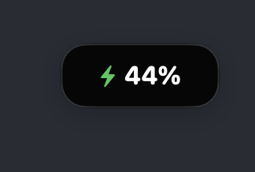
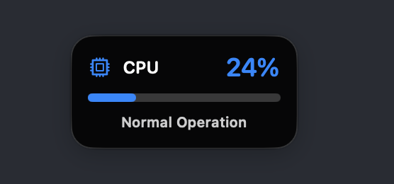
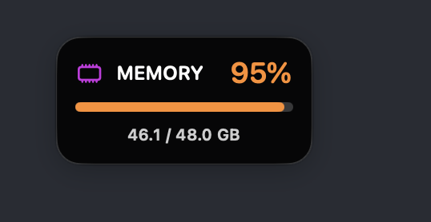
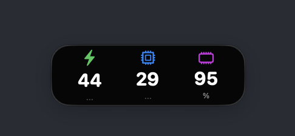
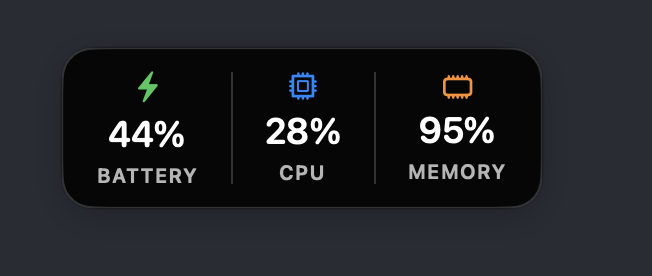
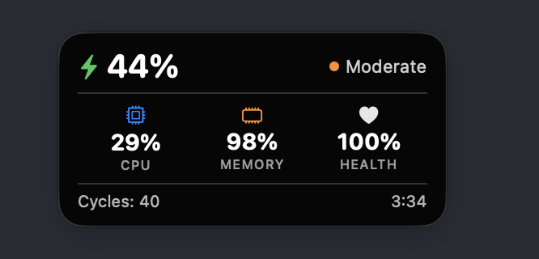
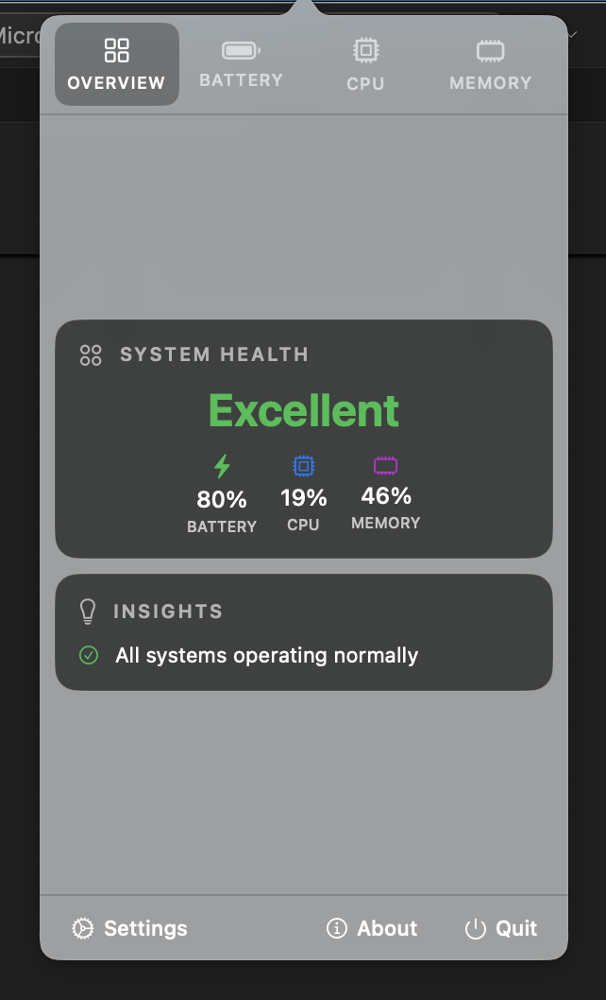
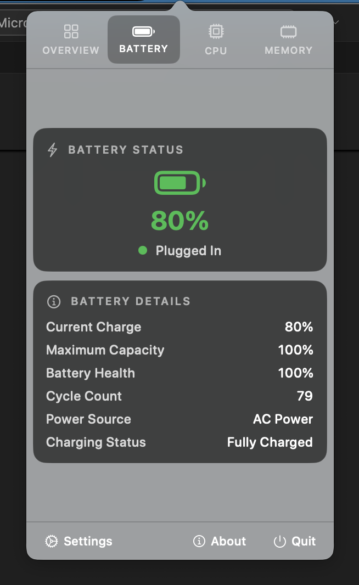
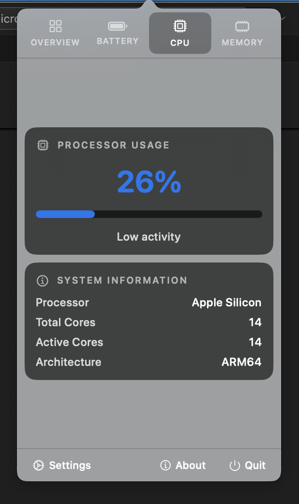
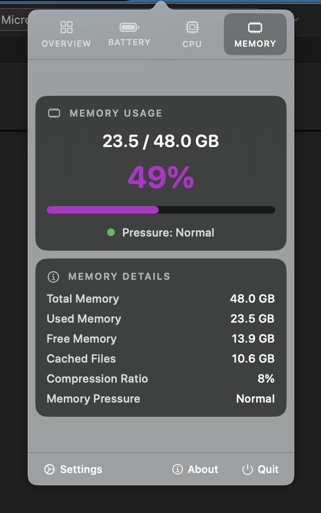

# Microverse

**macOS system monitoring with elegant desktop widgets**

[](https://swift.org)
[](https://developer.apple.com/macos/)
[](LICENSE)

[**Download**](https://github.com/ashwch/microverse/releases/latest) • [Documentation](docs/) • [Issues](https://github.com/ashwch/microverse/issues)

## Screenshots

### Desktop Widgets
<table>
<tr>
<td><br><b>Battery</b></td>
<td><br><b>CPU</b></td>
<td><br><b>Memory</b></td>
</tr>
<tr>
<td><br><b>System Glance</b></td>
<td><br><b>System Status</b></td>
<td><br><b>System Dashboard</b></td>
</tr>
</table>

### App Interface
<table>
<tr>
<td><br><b>Overview</b></td>
<td><br><b>Battery Details</b></td>
</tr>
<tr>
<td><br><b>CPU Monitoring</b></td>
<td><br><b>Memory Analysis</b></td>
</tr>
</table>

## Features

**System Monitoring**
- 🔋 Battery health, cycle count, and time estimates  
- ⚙️ Real-time CPU usage and core details
- 🧠 Memory pressure and breakdown
- 📊 System health overview with insights

**Interface**  
- 6 desktop widget styles (simple to comprehensive)
- Menu bar integration with alien icon
- Tabbed interface (Overview/Battery/CPU/Memory)
- Adaptive refresh rates for performance

**Design**
- Glass effects with light/dark mode
- <1% CPU impact, <50MB memory
- Semantic colors (🟢 Battery, 🔵 CPU, 🟣 Memory)

## Installation

**[Download Latest Release](https://github.com/ashwch/microverse/releases/latest)**

1. Download `Microverse.dmg` 
2. Drag to Applications
3. **Security**: System Settings → Privacy & Security → "Open Anyway" 
4. Look for 👽 icon in menu bar

### ⚠️ Important: macOS Security Permissions

**When you first launch Microverse, macOS will block it because it's not from an identified developer.**

1. **Double-click Microverse** → You'll see "can't be opened"
2. **System Settings** → Privacy & Security  
3. **Scroll down** → "Microverse was blocked from use"
4. **Click "Open Anyway"** → Enter password → **"Open"**

*This is one-time only. After this, Microverse launches normally.*

**Build from Source**
```bash
git clone https://github.com/ashwch/microverse.git
cd microverse  
make install
```

Requires macOS 11.0+

## Usage

**Menu Bar**: Click 👽 icon → Overview/Battery/CPU/Memory tabs  
**Desktop Widgets**: Enable in Settings → 6 styles available  
**Widget Positioning**: Drag anywhere on desktop

## Tech Stack

- **SwiftUI** with async/await
- **IOKit & mach** for system monitoring  
- **Swift Package Manager** modular architecture

## Contributing

1. Fork the repository
2. Create a feature branch
3. Follow the existing code style
4. Submit a pull request

See [docs/](docs/) for technical details.

## 📄 License

This project is licensed under the MIT License - see the [LICENSE](LICENSE) file for details.

**Free and open source forever.** ✨

## 👨‍💻 Author

**Ashwini Chaudhary** - Creator and maintainer

## 🙏 Acknowledgments

- Built with ❤️ for the macOS development community
- Inspired by the need for elegant, performant system monitoring
- Design philosophy focused on clarity and elegance
- Engineering approach emphasizing performance and efficiency

---

**⭐ If Microverse helps you monitor your system, please star the repository to show your support!**

---

*Latest version includes complete settings UI redesign and full functionality for all toggles and controls.*