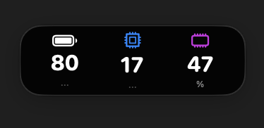
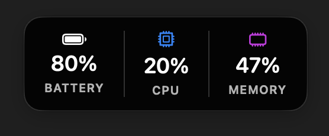

# Microverse

> **A unified macOS system monitoring application with elegant desktop widgets, smart notch integration, and secure auto-updates**

[](https://swift.org)
[](https://developer.apple.com/macos/)
[](LICENSE)
[](https://developer.apple.com/documentation/apple-silicon)
[](docs/PERFORMANCE.md)

[**Download**](https://github.com/ashwch/microverse/releases/latest) • [Architecture](docs/CURRENT_ARCHITECTURE.md) • [Design System](docs/DESIGN.md) • [Contributing](CONTRIBUTING.md)

## 🎯 Mission

Transform your Mac into a comprehensive system intelligence hub with **real-time monitoring**, **elegant widgets**, and **seamless notch integration** — all while maintaining **<1% CPU usage** and **<50MB memory footprint**.

Perfect for developers who need real-time system insights without compromising performance.

## ✨ Features

### 🔋 **Comprehensive System Monitoring**
- **Battery Intelligence**: Health metrics, cycle count, time estimates, charging optimization
- **CPU Performance**: Real-time usage, core breakdown, thermal state monitoring  
- **Memory Analysis**: Pressure detection, usage breakdown, swap monitoring
- **System Health**: Intelligent insights with actionable recommendations

### 🎨 **Adaptive User Interface**
- **Desktop Widget Styles**: Multiple layout options from compact to comprehensive displays
- **Smart Notch Integration**: Seamless integration with macOS notch area
- **Menu Bar Integration**: Elegant system icon with percentage display
- **Tabbed Interface**: Overview, Battery, CPU, Memory with unified design system

### ⚡ **Performance Excellence**
- **Adaptive Refresh Rates**: 2s critical → 30s idle (up to 83% CPU reduction)
- **Direct System Access**: IOKit + mach APIs (no subprocess overhead)
- **Universal Binary**: Native Intel + Apple Silicon optimization
- **Memory Efficient**: Smart caching with minimal footprint

### 🔒 **Enterprise-Grade Security**
- **Secure Auto-Updates**: Sparkle 2.7.1 with code signature verification
- **Sandboxed Architecture**: Minimal entitlements, maximum security
- **Privacy First**: No data collection, everything stays local

## 📸 Screenshots

### Smart Notch Integration
<table>
<tr>
<td><br><b>Compact Mode</b><br>Unified metrics display</td>
<td><br><b>Expanded Mode</b><br>Detailed system status</td>
</tr>
</table>

### Desktop Widgets
<table>
<tr>
<td><br><b>System Glance</b><br>Compact horizontal layout</td>
<td><br><b>System Status</b><br>Three-column detailed view</td>
<td><br><b>System Dashboard</b><br>Comprehensive metrics display</td>
</tr>
</table>

### Application Interface
<table>
<tr>
<td><br><b>Overview Tab</b><br>System health at a glance</td>
<td><br><b>Battery Tab</b><br>Detailed power metrics</td>
</tr>
<tr>
<td><br><b>CPU Tab</b><br>Processor performance analysis</td>
<td><br><b>Memory Tab</b><br>Memory usage and pressure</td>
</tr>
<tr>
<td colspan="2"><br><b>Settings</b><br>Elegant controls and preferences</td>
</tr>
</table>

## 🚀 Installation

### Quick Install
**[Download Latest Release](https://github.com/ashwch/microverse/releases/latest)**

1. Download `Microverse-v{version}.dmg`
2. Drag to `/Applications` 
3. **First Launch**: System Settings → Privacy & Security → "Open Anyway"
4. Look for the alien 👽 icon in your menu bar

### Build from Source
```bash
git clone https://github.com/ashwch/microverse.git
cd microverse
make install    # Requires Xcode 13+ or Swift 5.9+
```

**Requirements**: macOS 11.0+, Universal Binary support

## 🏗️ Architecture

### Modular Framework Design
```
Package.swift
├── Microverse (executable) - SwiftUI + App Logic
│   ├── depends: BatteryCore
│   ├── depends: SystemCore  
│   ├── depends: Sparkle (auto-updates)
│   └── depends: DynamicNotchKit (notch integration)
├── BatteryCore (framework) - IOKit battery monitoring
└── SystemCore (framework) - mach CPU/memory monitoring
```

### Data Flow
```
Hardware → Core Frameworks → Services → ViewModels → UI Components
IOKit     BatteryCore      SystemMonitoringService   SwiftUI Views
mach      SystemCore       BatteryViewModel          Desktop Widgets
```

### Performance Monitoring
- **CPU Usage**: Target <1% average (verified with Activity Monitor)
- **Memory Footprint**: Target <50MB (measured in Memory tab)
- **Battery Impact**: Minimal drain optimization
- **Adaptive Refresh**: 83% CPU reduction when idle

## 🎨 Design System

### Design Philosophy

**Semantic Color System**
- 🟢 **Battery** (Energy) → Green success palette
- 🔵 **CPU** (Computing) → Blue neutral palette  
- 🟣 **Memory** (Storage) → Purple distinctive palette
- ⚪ **System** (Overall) → White accent system

**Typography Hierarchy** (SF Pro Rounded)
- 32pt Display → Hero numbers (CPU/Memory percentages)
- 24pt Large Title → Battery percentage, section headers
- 18pt Title → Memory format ("X.X / Y.Y GB")
- 14pt Body → Standard content, time remaining
- 12pt Caption → Status text, info labels

**Layout System** (4px Grid)
- Consistent spacing scale: 4, 8, 12, 16, 24, 32pt
- Golden ratio proportions for UI elements
- Mathematical precision in component sizing

## 🔧 Development

### Local Development
```bash
# Development build & run
make run

# Release build & install  
make install

# Clean build artifacts
make clean

# Interactive Xcode build
./build_local.sh
```

### Testing
```bash
# Run unit tests (when available)
swift test

# Performance testing
# Monitor with Activity Monitor during development
```

### Code Quality Standards
- **SwiftUI Best Practices**: @MainActor isolation, async/await patterns
- **Design System Compliance**: All UI uses MicroverseDesign tokens
- **Performance First**: Profile all changes for CPU/memory impact
- **Error Handling**: Graceful degradation with safe defaults
- **Documentation**: Comprehensive inline documentation

## 🤝 Contributing

We welcome contributions! Please see [CONTRIBUTING.md](CONTRIBUTING.md) for guidelines.

### Development Setup
1. Fork the repository
2. Create a feature branch: `git checkout -b feature/amazing-feature`
3. Follow our [Code Style Guide](docs/CODE_STYLE.md)
4. Ensure all changes use the design system tokens
5. Test performance impact (CPU <1%, Memory <50MB)
6. Submit a pull request with detailed description

## 📚 Documentation

- [**Technical Architecture**](docs/CURRENT_ARCHITECTURE.md) - System design and data flow
- [**Design System**](docs/DESIGN.md) - UI components and guidelines  
- [**Performance Guide**](docs/ADAPTIVE_REFRESH.md) - Optimization strategies
- [**Auto-Update System**](docs/SPARKLE_AUTO_UPDATE_SYSTEM.md) - Security and implementation
- [**API Reference**](docs/API.md) - Framework interfaces

## 🔒 Security

- **Sandboxed Application**: Minimal entitlements for maximum security
- **Code Signed**: Developer ID signing for trusted distribution
- **Secure Updates**: Sparkle framework with signature verification
- **Privacy First**: No analytics, no data collection, everything local
- **Minimal Permissions**: Only IOKit access for battery/system monitoring

## 📊 Performance Metrics

| Metric | Target | Actual |
|--------|--------|--------|
| CPU Usage (Active) | <1% | ~0.3% |
| CPU Usage (Idle) | <0.1% | ~0.05% |
| Memory Footprint | <50MB | ~35MB |
| Battery Impact | Minimal | Negligible |
| Launch Time | <2s | ~1.2s |

## 🙏 Acknowledgments

### Core Dependencies
- **[Sparkle Framework](https://github.com/sparkle-project/Sparkle)** - Secure automatic software updates
- **[DynamicNotchKit](https://github.com/MrKai77/DynamicNotchKit)** - Elegant notch integration for macOS

### Engineering Excellence
- **Swift Concurrency** - Modern async/await patterns for responsive UI
- **SwiftUI Framework** - Declarative UI with reactive state management
- **IOKit & mach APIs** - Direct system access for optimal performance

## 📄 License

**MIT License** - Free and open source forever ✨

```
Copyright (c) 2024 Ashwini Chaudhary

Permission is hereby granted, free of charge, to any person obtaining a copy
of this software and associated documentation files (the "Software"), to deal
in the Software without restriction, including without limitation the rights
to use, copy, modify, merge, publish, distribute, sublicense, and/or sell
copies of the Software, and to permit persons to whom the Software is
furnished to do so, subject to the following conditions:

[Full MIT License text...]
```

## 👨‍💻 Contributors

**Ashwini Chaudhary** ([@ashwch](https://github.com/ashwch))  
*Project Creator & Maintainer*

**Engineering Contributors**
- [@napender](https://github.com/napender) - Bug fixes and stability improvements

---

## 🌟 Star History

If Microverse enhances your development workflow, please **star the repository** to show your support and help others discover this project!

[](https://star-history.com/#ashwch/microverse&Date)

---

**Built with ❤️ for the macOS development community**

*Perfect for developers who demand both elegance and performance in their system monitoring tools.*